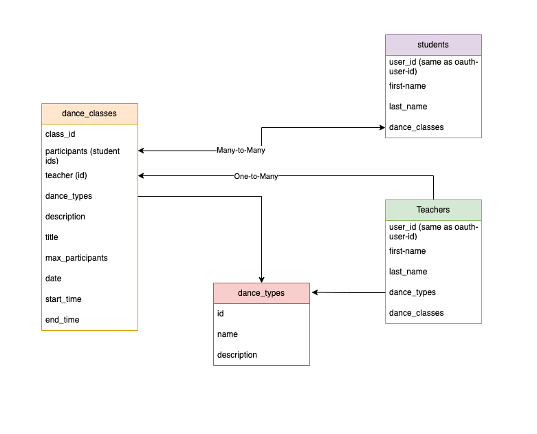

# Dancing Queen Studio Project

## Specifications

Roles will include at least…
- Two roles with different permissions
- Permissions specified for all endpoints
Tests will include at least….
- One test for success behavior of each endpoint
- One test for error behavior of each endpoint
- At least two tests of RBAC for each role

## Introduction

This project is a digital dancing school where dance teachers can create and manage dance courses. 
Students can register to a course they like.

## Models




## API Endpoints

# TODO: FINISH ME
GET /me

GET /teachers
GET /teachers/:id
POST /teachers
PATCH /teachers/:id
DELETE /teachers/:id

GET /students
GET /students/:id
POST /students
PATCH /students/:id
DELETE /students/:id

GET /dance-types

---

### `GET '/classes?page=${integer}'`

- Returns a list of paginated dance classes.
- Request Query: 
  - page - integer (optional)

- Response schema:
```
{
  "success": <Boolean>,
  "classes: List<Dict>,
  "total_classes": <int>
}
```

- Response example:
```json
{
    "classes": [
        {
            "dance_types": [
                "ballet"
            ],
            "date": "Sat, 25 Mar 2023 00:00:00 GMT",
            "description": "This a ballet dance class",
            "end_time": "20:00",
            "id": 1,
            "max_participants": 15,
            "participants": [
                {
                    "first_name": "Jane",
                    "id": 1,
                    "last_name": "Doe"
                }
            ],
            "start_time": null,
            "teacher": {
                "first_name": "John",
                "id": 1,
                "last_name": "Doe"
            },
            "title": "Ballet for Everyone"
        }
    ],
    "success": true,
    "total_classes": 12
}
```

---

### `GET '/classes/${class_id}'`

- Gets a dance class by its given id
- Request Parameter: 
  - class_id (required)
- Response schema:

```
{
  "success": <Boolean>,
  "class": <Dict>
}
```

- Response example:
```json
{
    "success": true,
    "class": {
        "dance_types": [
            "hiphop"
        ],
        "date": "Mon, 20 Mar 2023 00:00:00 GMT",
        "description": "I am an amazing dance class",
        "end_time": "20:00",
        "id": 2,
        "max_participants": 15,
        "participants": [],
        "start_time": "18:00",
        "teacher": {
            "first_name": "John",
            "id": 1,
            "last_name": "Doe"
        },
        "title": "Amazing class"
    }
}
```

---

### `POST '/classes'`

- Creates a dance class with given properties if user is a teacher
- Request body (in alphabetical order): 
  - date (required)
  - dance_types (required)
  - description (required)
  - end_time (required)
  - max_participants (required)
  - start_time (required)
  - title (required)
  
- Response schema:
```
{
  "success": <Boolean>,
  "class": <Dict>
}
```

- Response example:
```json
{
    "class": {
        "dance_types": [
            "hiphop"
        ],
        "date": "Mon, 20 Mar 2023 00:00:00 GMT",
        "description": "I am an amazing dance class",
        "end_time": "20:00",
        "id": 2,
        "max_participants": 15,
        "participants": [],
        "start_time": "18:00",
        "teacher": {
            "first_name": "John",
            "id": 1,
            "last_name": "Doe"
        },
        "title": "Amazing class"
    },
    "success": true
}
```

---

### `DELETE '/classes/${class_id}'`

- Deletes a dance class by its given id
- Request Parameter: 
  - class_id (required)
- Response schema:

```
{
  "success": <Boolean>,
  "deleted": <int>
}
```

- Response example:
```json
{
    "success": true,
    "deleted": 1
}
```

---

### `PATCH '/classes/${class_id}'`

- Updates a specific dance class if user is a teacher
- Request body (in alphabetical order): 
  - date (optional)
  - dance_types (optional)
  - description (optional)
  - end_time (optional)
  - start_time (optional)
  - title (optional)
  
- Response schema:
```
{
  "success": <Boolean>,
  "class": <Dict>
}
```

- Response example:
```json
{
    "class": {
        "dance_types": [
            "hiphop"
        ],
        "date": "Mon, 20 Mar 2023 00:00:00 GMT",
        "description": "I am an amazing dance class",
        "end_time": "20:00",
        "id": 2,
        "max_participants": 15,
        "participants": [],
        "start_time": "18:00",
        "teacher": {
            "first_name": "John",
            "id": 1,
            "last_name": "Doe"
        },
        "title": "Amazing class"
    },
    "success": true
}
```

---

### `POST '/classes/${class_id}/participants'`

- Adds a student as a new participant to an existing dance class
- Request Parameter: 
  - class_id (required)
- Request body: 
  - user_id (required)
- Response schema:
```
{
  "success": <Boolean>,
  "class_id": <Int>,
  "added_participant": <Dict>
}
```

- Response example:
```json
{
  "added_participant": {
    "first_name": "Joe",
    "id": 1,
    "last_name": "Doe"
  },
  "class_id": 5,  
  "success": true
}
```

---

### `DELETE '/classes/${class_id}/participants'`

- Removes a participant from a dance class
- Request Parameter: 
  - class_id (required)
- Request body: 
  - user_id (required)
- Response schema:

```
{
  "success": <Boolean>,
  "class_id": <Int>,
  "removed_participant": <Dict>
}
```

- Response example:
```json
{
  "class_id": 5,  
  "success": true,
    "removed_participant": {
      "first_name": "Joe",
      "id": 1,
      "last_name": "Doe"
    }
}
```

---


## API Errors

When a request fails, the API will send on of the following errors:

- 400: Bad Request 
- 401: Unauthorized 
- 403: Forbidden 
- 404: Resource not found 
- 405: Method Not Allowed 
- 422: Unprocessable 
- 500: Internal Server Error

Error schema
```
{
  "success": <Boolean>,
  "error": <Int>,
  "message": <String>
}
```

Error example for 404:

```json
{
  "success": false,
  "error": 404,
  "message": "Resource not found"
}
```

## Frontend

## Deployment

Render.com is linked to this Github repository, whenever a new commit is pushed on 
master, it triggers a new deployment using the last commit.